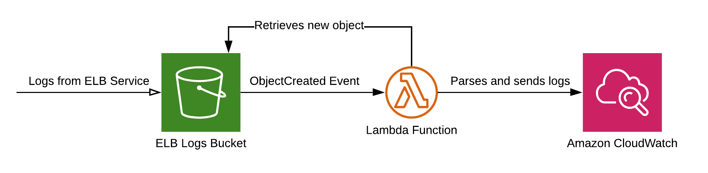

# AWS Load Balancer S3 Logs to CloudWatch Logs
Stream AWS Load Balancer Logs that are delivered to S3 into CloudWatch Logs for use with features like CloudWatch Logs Insights.

Logs are loaded from S3 as they are created using an [S3 Event Notification](https://docs.aws.amazon.com/lambda/latest/dg/with-s3.html). The logs are then parsed into JSON format and shipped to Cloudwatch Logs.

# Usage
`cfn/example.yml` shows how to deploy the Lambda alongside Classic, Application or Network Load Balancers. Use this template as a starting point for your deployment.

The Lambda takes the following environment variables:
  - `LOG_GROUP_NAME`: The name of the Log Group to ship to
  - `LOAD_BALANCER_TYPE`: The load balancer type. Must be `classic`, `application` or `network`
  - `PLAINTEXT_LOGS`: If set to anything will ship the plaintext log line instead of parsing it to JSON

For testing any changes, use `cfn/example-pipeline.yml` to deploy an ELB, ALB and NLB with the logging buckets and Lambdas shipping to Log Groups. The pipeline template also contains an example of a CodeBuild Project to build the Lambda function code.

# Credits
Based on https://github.com/amazon-archives/cloudwatch-logs-centralize-logs